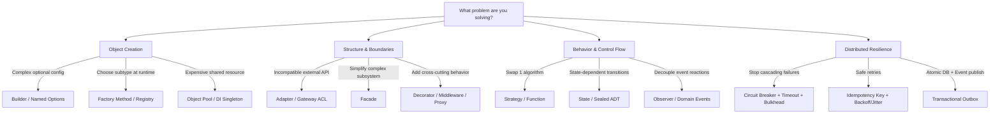

# Decision Trees by Problem

```mermaid
flowchart TD
    P["What problem are you solving?"]
    P --> C["Object Creation"]
    P --> S["Structure & Boundaries"]
    P --> B["Behavior & Control Flow"]
    P --> D["Distributed Resilience"]

    C -->|Complex optional config| C1["Builder / Named Options"]
    C -->|Choose subtype at runtime| C2["Factory Method / Registry"]
    C -->|Expensive shared resource| C3["Object Pool / DI Singleton"]

    S -->|Incompatible external API| S1["Adapter / Gateway ACL"]
    S -->|Simplify complex subsystem| S2["Facade"]
    S -->|Add cross-cutting behavior| S3["Decorator / Middleware / Proxy"]

    B -->|Swap 1 algorithm| B1["Strategy / Function"]
    B -->|State-dependent transitions| B2["State / Sealed ADT"]
    B -->|Decouple event reactions| B3["Observer / Domain Events"]

    D -->|Stop cascading failures| D1["Circuit Breaker + Timeout + Bulkhead"]
    D -->|Safe retries| D2["Idempotency Key + Backoff/Jitter"]
    D -->|Atomic DB + Event publish| D3["Transactional Outbox"]
```
