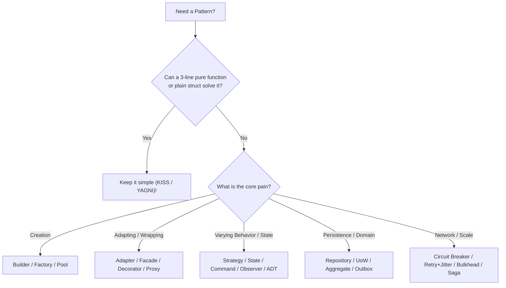

# Pattern Selection Flowchart

```mermaid
flowchart TD
    Start["Need a Pattern?"] --> Q1{"Can a 3-line pure function<br/>or plain struct solve it?"}
    Q1 -- Yes --> Plain["Keep it simple (KISS / YAGNI)!"]
    Q1 -- No --> Q2{"What is the core pain?"}
    Q2 -->|Creation| Cr["Builder / Factory / Pool"]
    Q2 -->|Adapting / Wrapping| St["Adapter / Facade / Decorator / Proxy"]
    Q2 -->|Varying Behavior / State| Bh["Strategy / State / Command / Observer / ADT"]
    Q2 -->|Persistence / Domain| En["Repository / UoW / Aggregate / Outbox"]
    Q2 -->|Network / Scale| Cl["Circuit Breaker / Retry+Jitter / Bulkhead / Saga"]
```
